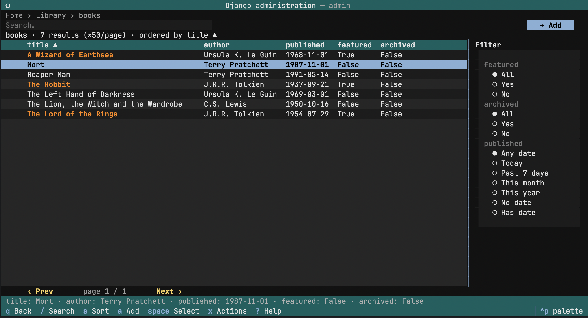

# dj-admin-tui

A [Textual](https://textual.textualize.io/) terminal UI that drives the **Django
admin** from your terminal: browse, search, filter, sort, create, edit, delete,
and run admin actions — honoring the **same permissions and audit log** as the
web admin, because it reuses Django's own admin internals rather than
reimplementing them.

It works with **zero configuration**: any project that has `ModelAdmin`s gets a
working terminal admin with no extra code. Write a `tui.py` only when you want
TUI-specific behaviour.



## Trust model — read first

The TUI runs **in-process** as a `manage.py` subcommand. There is no network
port, no token, no remote API.

!!! warning "The `--user` flag is not access control"
    Whoever can run `manage.py` on the host already has full database access.
    The `--user` flag scopes which records the operator sees and attributes
    audit entries to that account — it is **not** an access-control boundary.
    Access control is the host's responsibility (Unix permissions, SSH, etc.).

## Quick start

```bash
pip install dj-admin-tui
```

```python
# settings.py
INSTALLED_APPS += ["dj_admin_tui"]
```

```bash
python manage.py admin_tui                # run as the lone superuser
python manage.py admin_tui --user alice   # run as alice (must be is_staff)
```

You land on an index of every app and model the web admin would show that user.
Arrows + Enter (or the mouse) to drill in, `q` to quit, `?` for help.

## Where to next

| Topic | What it covers |
|-------|----------------|
| [Installation](installation.md) | Requirements, install, first launch, trust model |
| [Usage](usage.md) | Keymap, mouse map, search / sort / filter, the screens |
| [Configuration](configuration.md) | The `ADMIN_TUI` settings dict |
| [CLI](cli.md) | The `manage.py admin_tui` command, flags, exit codes |
| [Theming](theming.md) | Bundled themes, custom themes, `.tcss` overrides |
| [Extending](extending.md) | `TuiAdmin` overlays, hooks, custom widgets & screens |
| [API reference](api.md) | The public Python API and stability policy |
| [Architecture](architecture.md) | How it fits together; the reuse-the-admin design |

## Supported versions

- **Python:** 3.12, 3.13, 3.14
- **Django:** 4.2 LTS, 5.2 LTS, 6.0
- **Textual:** `>=8.2,<9`
